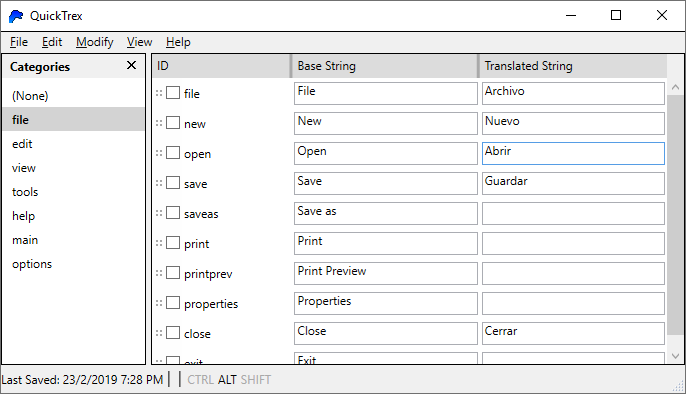

# QuickTrex
A quick and simple localization program, for usage by small/hobbyist developers! It lacks the advanced features found in more professional offerings, but for when you just want to start out with something small and tiny, this may work for you!

[Get started with it today!](https://github.com/JaykeBird/QuickTrex/releases)

## Features
* Organize strings into categories
* Write translations in your language while seeing the text in the original language
* Export to XML, JSON, XAML ResourceDictionary, CSV, and more!

## License
QuickTrex is licensed under the [MIT License](LICENSE).

## Release requirements
To use QuickTrex, you need to have:

* .NET Framework 4.5
* Windows Vista SP2 or later
* like... maybe 10 MB of free space? not even?

If you have Windows 8 or Windows 10, you already have .NET Framework 4.5!

## Development requirements
I use Visual Studio 2017 (version 15.8) to develop QuickTrex, but in theory, you should be fine with Visual Studio 2013 or later. No guarantees though!

There are no external packages or anything you need to get started (as of right now). Just open the solution, hit Start, and there you go!